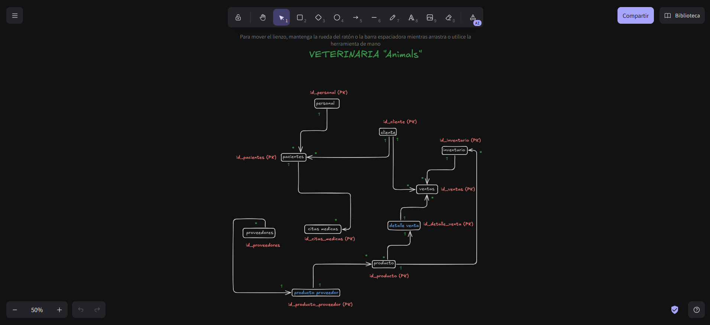

# Sistema de Gestión de Base de Datos Veterinaria

## 📋 Descripción General
Este proyecto es una base de datos relacional diseñada para gestionar las operaciones de una clínica veterinaria, incluyendo personal, clientes, pacientes, inventario y ventas. Se utiliza MySQL para manejar los datos de forma eficiente y se implementan claves foráneas para garantizar la integridad de los datos.

---

## 📊 Diagrama de Entidad-Relación (PROVISONAL, LUEGO A MEJORAR)

A continuación se presenta el diagrama de entidad-relación de la base de datos:

RUTA: https://excalidraw.com/#json=jQ7t_vBPIAvuw-FcBTgo6,f_4u3atDlCHA8K_4J_duZw

---

## 🛠️ Funcionalidades
- **Gestión de Personal**: Registra información de los empleados, como identificadores únicos, nombres y contactos.
- **Clientes y Pacientes**: Almacena datos de los clientes y los vincula con sus respectivas mascotas (pacientes).
- **Gestión de Productos e Inventario**: Administra detalles de productos, niveles de stock, proveedores y entregas.
- **Seguimiento de Ventas**: Registra las transacciones, incluyendo detalles y productos asociados.
- **Citas Médicas**: Gestiona las citas médicas de los pacientes, vinculadas al personal y a los clientes.

---

## 🗂️ Estructura de la Base de Datos

### Tablas
1. **personal**: Almacena información sobre los empleados de la clínica.
   - Atributos: `id_personal`, `nombre`, `dni`, `email`.

2. **cliente**: Contiene los datos de los clientes.
   - Atributos: `id_cliente`, `email`, `tipo_pago`.

3. **pacientes**: Representa a las mascotas atendidas en la clínica.
   - Atributos: `id_pacientes`.

4. **productos**: Almacena información sobre los productos, como stock y precios.
   - Atributos: `id_productos`, `nombre`, `fecha_vencimiento`, `stock`, `unidad_medida`, `precio`.

5. **inventario**: Administra los productos en inventario.
   - Atributos: `id_inventario`, `id_producto`.

6. **venta**: Registra las transacciones de ventas.
   - Atributos: `id_venta`, `id_personal`, `id_cliente`, `precio_bruto`, `valor_igi`, `tiempo_venta`.

7. **detalle_venta**: Detalla los productos involucrados en cada venta.
   - Atributos: `id_detalle_venta`, `id_cliente`, `id_venta`, `id_producto`, `cantidad`.

8. **proveedor**: Almacena los datos de los proveedores.
   - Atributos: `id_proveedor`, `nombre`, `cuit`, `encargado`.

9. **producto_proveedor**: Vincula productos con proveedores.
   - Atributos: `id_producto_proveedor`, `id_proveedor`, `id_productos`, `fechas_entregas`.

10. **citas_medicas**: Gestiona las citas programadas.
    - Atributos: `id_citas_medicas`, `id_pacientes`, `id_personal`.

---

### Relaciones
La base de datos utiliza claves foráneas para mantener las relaciones entre tablas:
- **venta** está vinculada a **personal** y **cliente**.
- **detalle_venta** está vinculada a **cliente**, **venta** y **productos**.
- **producto_proveedor** vincula **productos** con **proveedor**.
- **inventario** está relacionado con **productos**.
- **citas_medicas** está vinculada a **pacientes** y **personal**.

---

## 🔧 Esquema SQL
El esquema de la base de datos incluye las siguientes características clave:
- Claves foráneas para mantener las relaciones entre tablas.
- Restricciones de unicidad en identificadores como `dni` y `cuit`.

---

## 🚀 Uso
1. **Configuración**:
   - Instalar MySQL y asegurarse de que esté en funcionamiento.
   - Ejecutar el script SQL proporcionado para inicializar la base de datos.
   
2. **Ejecutar Consultas**:
   - Utilizar un cliente SQL o la extensión de MySQL en VS Code para interactuar con la base de datos.

---

## 📌 Mejoras Futuras
- Añadir un registro detallado de citas y ventas.
- Introducir análisis de tendencias de stock y ventas.
- Ampliar los registros de pacientes con historial médico y detalles adicionales.

---

## 👥 Créditos
Este proyecto fue desarrollado como parte del curso de SQL de Coderhouse.

---

## 🤝 Colaboraciones

Actualmente, este proyecto no está disponible para colaboraciones, ya que es un desarrollo académico realizado como parte del curso de SQL en Coderhouse. 

---

### 🔗 Referencias
- [Documentación de MySQL](https://dev.mysql.com/doc/)
- Material del curso de Coderhouse (privado)
